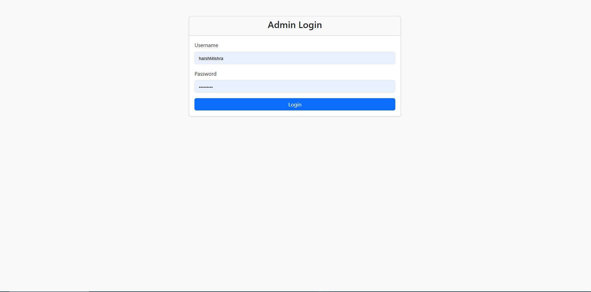
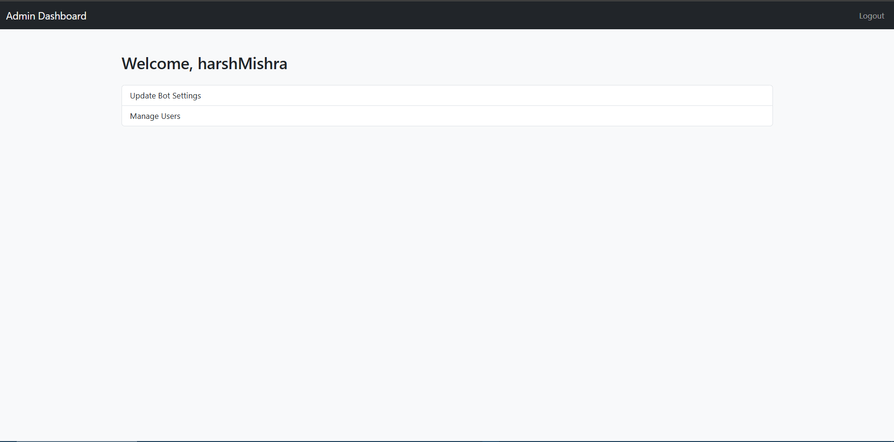
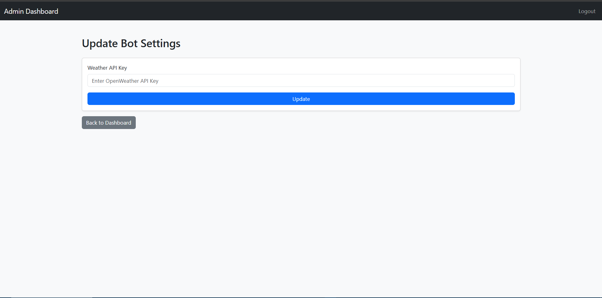
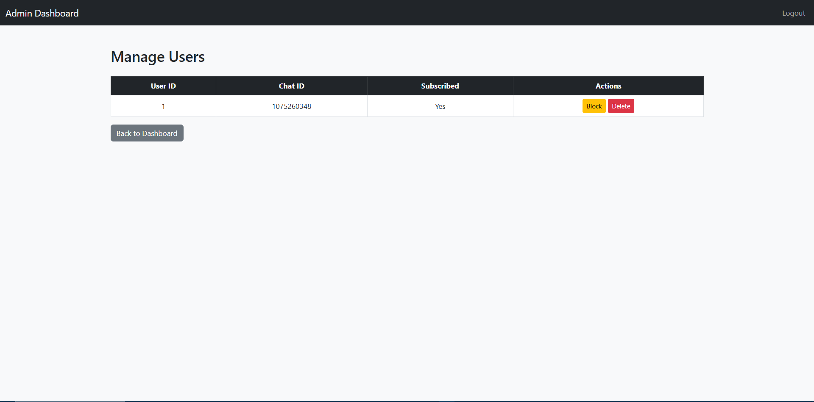
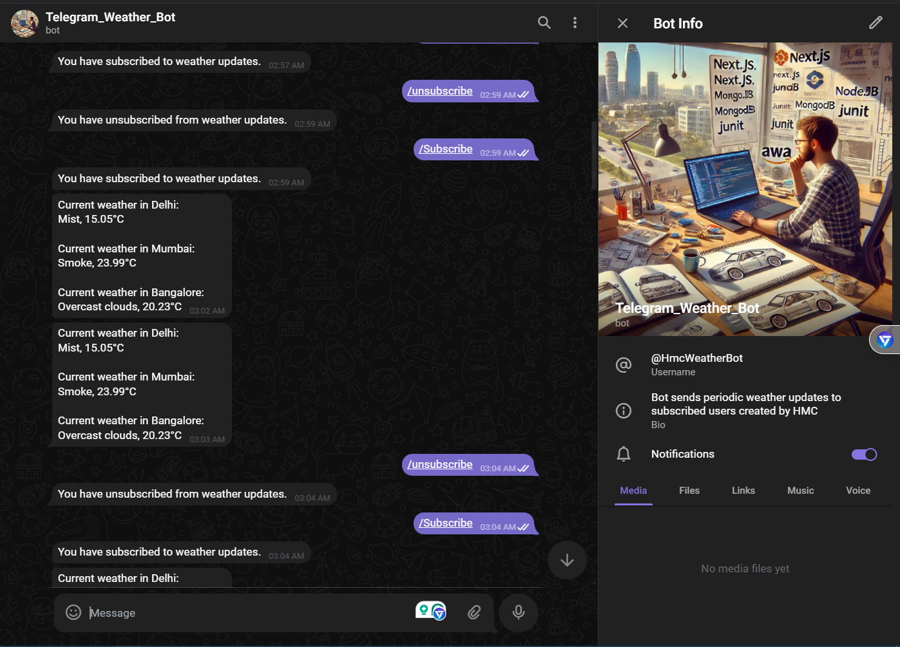

# Telegram Weather Bot


## Table of Contents

- [Overview](#overview)
- [Features](#features)
- [Technologies Used](#technologies-used)
- [Project Structure](#project-structure)
- [Installation](#installation)
  - [Prerequisites](#prerequisites)
  - [Steps](#steps)
- [Configuration](#configuration)
- [Running the Application](#running-the-application)
- [Usage](#usage)
- [Video Walkthrough](#video-walkthrough)
- [Screenshots](#screenshots)
- [Author](#author)
- [License](#license)

## Overview

The **Telegram Weather Bot** is a project that provides a weather update service using a Telegram bot. The bot allows users to subscribe to weather updates for the cities of Delhi, Mumbai, and Bangalore. An admin panel allows the management of bot settings, including the API key for weather information and user accounts for blocking or deleting users.

## Features

- **Weather Updates**: Provides periodic weather updates for Delhi, Mumbai, and Bangalore.
- **User Subscription**: Users can subscribe and unsubscribe to weather updates using simple commands.
- **Admin Panel**: Admins can update bot settings, manage user accounts, and control user access.
- **Easy Deployment**: The bot and admin panel can be easily deployed to a hosting service like Railway.
- **RESTful Architecture**: Follows REST principles to handle user subscriptions and bot settings.

## Technologies Used

- **Python 3.8+**
- **Flask**
- **Flask SQLAlchemy**
- **Telegram Bot API (python-telegram-bot)**
- **SQLite**
- **Requests**
- **Flask-WTF**

## Project Structure

```plaintext
telegram_weather_bot/
├── app/
│   ├── __init__.py
│   ├── config.py
│   ├── models.py
│   └── forms.py
├── static/
│   └── screenshots/
├── templates/
│   ├── admin_login.html
│   ├── manage_users.html
│   ├── update_settings.html
│   └── dashboard.html
├── bot.py
├── create_db.py
├── run.py
├── requirements.txt
├── README.md
├── .gitignore
└── .env
```

- **app/**: Contains the main application modules including configurations, models, and forms for the Flask app.
- **static/screenshots/**: Directory for storing screenshots of different parts of the app.
- **templates/**: HTML templates used for rendering different views in the admin panel.
- **bot.py**: Main script for running the Telegram bot.
- **create_db.py**: Script for creating and initializing the SQLite database.
- **run.py**: Entry point to run the Flask admin panel.
- **requirements.txt**: Lists all Python dependencies.
- **README.md**: Project documentation.
- **.gitignore**: Specifies files and directories to be ignored by Git.
- **.env**: Stores environment variables (excluded from version control).

## Installation

### Prerequisites

- **Python 3.8 or higher**: Ensure Python is installed on your system. You can download it from [here](https://www.python.org/downloads/).
- **Git**: To clone the repository. Download Git from [here](https://git-scm.com/downloads).

### Steps

1. **Clone the Repository**

   ```bash
   git clone https://github.com/YOUR_USERNAME/telegram_weather_bot.git
   cd telegram_weather_bot
   ```

2. **Create a Virtual Environment**

   ```bash
   # On Windows
   python -m venv venv
   venv\Scripts\activate

   # On Unix or MacOS
   python3 -m venv venv
   source venv/bin/activate
   ```

3. **Install Dependencies**

   ```bash
   pip install -r requirements.txt
   ```

## Configuration

The application uses environment variables to manage sensitive information like the secret key and the Telegram bot token. These variables are stored in a `.env` file.

### Create a .env File

In the root directory of the project, create a `.env` file.

```bash
touch .env
```

### Add Environment Variables

Open the `.env` file and add the following:

```env
SECRET_KEY=your_secret_key
BOT_TOKEN=your_telegram_bot_token
WEATHER_API_KEY=your_openweather_api_key
SQLALCHEMY_DATABASE_URI=sqlite:///weather_bot.db
```

- **SECRET_KEY**: A secret key for Flask sessions.
- **BOT_TOKEN**: Your Telegram bot token from BotFather.
- **WEATHER_API_KEY**: Your API key from [OpenWeatherMap](https://home.openweathermap.org/api_keys).
- **SQLALCHEMY_DATABASE_URI**: The SQLite database URI for storing user information.

## Running the Application

### Activate the Virtual Environment

```bash
# On Windows
venv\Scripts\activate

# On Unix or MacOS
source venv/bin/activate
```

### Create the Database

```bash
python create_db.py
```

### Run the Flask Admin Panel

```bash
python run.py
```

The admin panel will start on `http://127.0.0.1:5000/` by default.

### Run the Telegram Bot

```bash
python bot.py
```

## Usage

- **Telegram Bot Commands**:
  - `/start`: Initiate interaction with the bot.
  - `/subscribe`: Subscribe to receive periodic weather updates.
  - `/unsubscribe`: Unsubscribe from receiving weather updates.

## Video Walkthrough

[Video Walkthrough Link](https://video.drift.com/v/abh5Nz18tovvF96JkijYqxSTaouTfFQJklE4QjF3edXQY/
)

## Screenshots

1. **Admin Login**

    

2. **Manage Users**

   

3. **Update Bot Settings**

   

4. **Telegram Bot Interaction**

  

## Telegram Bot


## Author

**Harsh Mishra**  
[GitHub](https://github.com/HARSHMISHRA-521) | [LinkedIn](http://www.linkedin.com/in/mishraharsh-hmc) | [Portfolio](https://harshmishra-521.github.io/MY-PORTFOLIO/) | [Resume](https://drive.google.com/drive/folders/1pGK1alOqsBhG7oRoVjr_QeOQf72o4TzL?usp=sharing) | [Medium](https://medium.com/@HARSHMISHRA_HMC) | [Replit](https://replit.com/@HARSHMISHRA34) | [Twitter](https://x.com/harsh_mishra___)

## License

This project is licensed under the [MIT License](LICENSE).

---

**Note**: Replace `your_secret_key`, `your_telegram_bot_token`, `your_openweather_api_key`, and other placeholders with your actual values.

